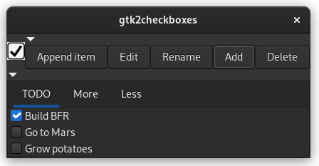

# Ruby-Gnome CheckBoxes

* [VERSION 3.1.230114](https://github.com/carlosjhr64/gtk2checkboxes/releases)
* [github](https://www.github.com/carlosjhr64/gtk2checkboxes)
* [rubygems](https://rubygems.org/gems/gtk2checkboxes)



## DESCRIPTION

More than just check-boxes.
Create a simple check list, bookmarks, or start menu.

## INSTALL
```shell
gem install gtk2checkboxes
```
## HELP
```shell
$ gtk2checkboxes --help
Usage:
  gtk2checkboxes [:options+]
Options:
  -h --help
  -v --version
  --minime      	 Real minime
  --notoggle    	 Minime wont toggle decorated and keep above
  --notdecorated	 Dont decorate window
```
## Logo mouse clicks

Mouse clicks on logo:

+ Button 1: minime
+ Button 2: nothing
+ Button 3: application menu

## Tool-bar buttons

* `Append item` to quickly add a check list item to the current list
* `Edit` to open the list's markdown file
* `Rename` to rename the current list
* `Add` to add a new list
* `Delete` to delete the current list

## Configuration

+ Configuration file: `~/.config/gtk3app/gtk2checkboxes/config-*.rbon`

You can change your editor to something else,
but the process should not detach(go to background).
For example, I edited my `Editor:` key from:

    Editor: "gedit $cachefile",

To:

    Editor: "nvim-qt --geometry 725x936 --nofork $cachefile",

## Check-boxes

In the list's markdown file:
Any line that looks like `- [ ] item` is considered to be a check box:
```markdown
- [ ] This is a unchecked item
- [x] This is a checked item
```
## Links

In the list's markdown file:
Any line that looks like `* [link](target)` is considered to be a link.
The target will be open by it's preferred application:
```markdown
* [Link to github](https://github.com)
```
## Commands

In the list's markdown file:
Any line that looks like `+ command: executable` is considered to be a command.
The executable is spawn when the command button is clicked:
```markdown
+ Spawn X-terminal: xterm
```
## Plain labels

In the list's markdown file:
Any line that looks like `* label` is considered to be a label:
```markdown
* Hello!
```
## Additional notes

Lines in the list's markdown file that does not match
any of the above match cases is ignored.

## LICENSE

(The MIT License)

Copyright (c) 2023 CarlosJHR64

Permission is hereby granted, free of charge, to any person obtaining
a copy of this software and associated documentation files (the
'Software'), to deal in the Software without restriction, including
without limitation the rights to use, copy, modify, merge, publish,
distribute, sublicense, and/or sell copies of the Software, and to
permit persons to whom the Software is furnished to do so, subject to
the following conditions:

The above copyright notice and this permission notice shall be
included in all copies or substantial portions of the Software.

THE SOFTWARE IS PROVIDED 'AS IS', WITHOUT WARRANTY OF ANY KIND,
EXPRESS OR IMPLIED, INCLUDING BUT NOT LIMITED TO THE WARRANTIES OF
MERCHANTABILITY, FITNESS FOR A PARTICULAR PURPOSE AND NONINFRINGEMENT.
IN NO EVENT SHALL THE AUTHORS OR COPYRIGHT HOLDERS BE LIABLE FOR ANY
CLAIM, DAMAGES OR OTHER LIABILITY, WHETHER IN AN ACTION OF CONTRACT,
TORT OR OTHERWISE, ARISING FROM, OUT OF OR IN CONNECTION WITH THE
SOFTWARE OR THE USE OR OTHER DEALINGS IN THE SOFTWARE.
